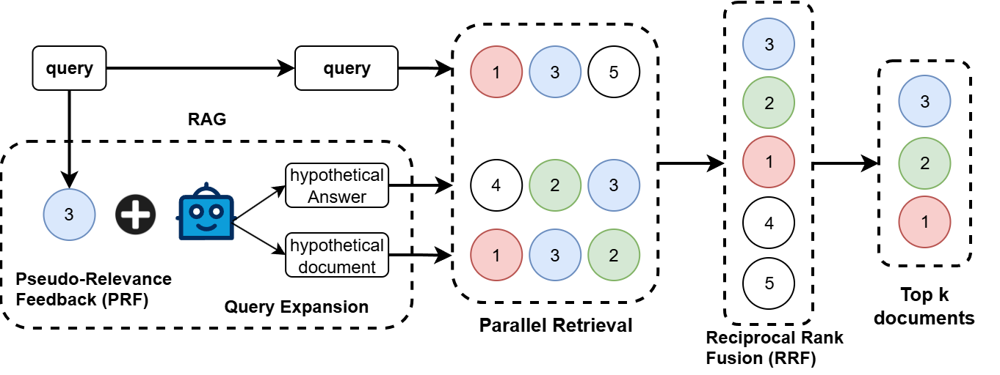

# RFG Framework: Retrieval-Feedback-Grounded Multi-Query Expansion

This repository accompanies the paper:

> **RFG Framework: Retrieval-Feedback-Grounded Multi-Query Expansion**  
> Ronaldinho Vega Centeno Olivera, Julio Cesar dos Reis, Allan Mariano de Souza  
> Institute of Computing, University of Campinas (UNICAMP), Brazil  
> Hub de Inteligência Artificial e Arquiteturas Cognitivas (H.IAAC), Brazil

📄 The paper was presented at **KDIR 2025**.

---

## 🌐 Overview

Information Retrieval (IR) systems often face query ambiguity and lexical mismatch, which hinder the performance of dense retrievers.  

**RFG** (Retrieval-Feedback-Grounded) introduces a novel query expansion framework that:

- Integrates **Retrieval-Augmented Generation (RAG)** and **Pseudo-Relevance Feedback (PRF)**.  
- Uses an initial retrieval to **ground LLMs**, reducing hallucinations.  
- Generates multiple **diverse pseudo-queries**.  
- Combines results through **Reciprocal Rank Fusion (RRF)** to obtain more relevant and diverse document sets.  

Experiments show that **RFG outperforms baseline methods** such as **HyDE** and **Query2doc**, benefiting both weaker and stronger retrieval models.

---

## 📊 Methodology

The **RFG framework** is structured in three main stages:

1. **Retrieval and Grounded Query Generation**  
   - An initial retrieval provides documents used as context for the LLM to generate diverse queries.  

2. **Document Retrieval and Aggregation**  
   - Each generated query triggers a new retrieval. Results are aggregated into a candidate set.  

3. **Rank Fusion (RRF)**  
   - Multiple retrieved lists are combined into a single optimized ranking.  



📌 Evaluation:  
- Benchmarks: **BEIR datasets** (ArguAna, NFCorpus, FiQA-2018, SciDocs).  
- Models: Contriever, DPR, Contriever-ft, GTE-large, BGE-large.  
- Main metric: **nDCG@10**.  

---

## 👥 Authors

- **Ronaldinho Vega Centeno Olivera** ([ORCID](https://orcid.org/0009-0001-4756-9726))  
- **Julio Cesar dos Reis** ([ORCID](https://orcid.org/0000-0002-9545-2098))  
- **Allan Mariano de Souza** ([ORCID](https://orcid.org/0000-0002-5518-8392))  

Institute of Computing – University of Campinas (UNICAMP), Brazil  
Hub de Inteligência Artificial e Arquiteturas Cognitivas (H.IAAC), Brazil  

---

## 📖 Citation

If you use this work, please cite the paper as follows:

```bibtex
@inproceedings{vega2025rfg,
  title     = {RFG Framework: Retrieval-Feedback-Grounded Multi-Query Expansion},
  author    = {Vega Centeno Olivera, Ronaldinho and dos Reis, Julio Cesar and de Souza, Allan Mariano},
  booktitle = {Proceedings of the 17th International Conference on Knowledge Discovery and Information Retrieval (KDIR)},
  year      = {2025}
}
```

---

## 📂 Resources

- 📑 [Paper PDF](./KDIR_2025_Ronaldinho.pdf)  
- 💻 Source code: [GitHub Repository](https://github.com/xxxx/xxxxxx) *(coming soon)*  

---

## 📝 License

This academic work is distributed under a **non-commercial use license**.  
Please refer to the conference publication policy for details.


## 🚀 Quick Start

Follow these steps to set up the environment and run experiments with **HyDE**, **Query2Doc**, and our proposed **RFG** framework.

---

### 1. Installation

```bash
# Install dependencies
pip install -r requirements.txt

# Install the project in editable mode
pip install -e .
```

---

### 2. Preprocess Datasets (Vector Store Creation)

Before running experiments, build the vector store for the datasets:

```python
from kdir_src.utils.qdrant import process_corpus

dataset_name = 'arguana'
process_corpus(dataset_name, 128, 128)
```

---

### 3. Run HyDE Experiments

```python
from kdir_src.sota.hyde import HyDE, Promptor
from kdir_src.generators.mistral_ai import MistralGenerator
from kdir_src.models.all_models import load_models, get_query_embeddings

KEY = ''  # Insert your API key
dataset_name = 'arguana'

promptor = Promptor(dataset_name)
generator = MistralGenerator('mistral-small-2503', KEY, 4)
encoder_models = load_models()

hyde = HyDE(dataset_name, promptor, generator, encoder_models)

# Save generated documents
hyde.save_generated_docs(path='../doc_gen/hyde/')

# Retrieve results
hyde.get_results_from_jsonl_hyde(
    path_doc_gen='../doc_gen/hyde/generated_documents_arguana.jsonl',
    path=f'../results/hyde/{dataset_name}/',
    batch_size=32,
    top_k=10
)

# Evaluate results
from kdir_src.utils.evaluation import evaluate_all_results
evaluate_all_results('../results/hyde/arguana')
```

---

### 4. Run Query2Doc Experiments

```python
from kdir_src.sota.query2doc import Query2Doc
from kdir_src.generators.mistral_ai import MistralGenerator
from kdir_src.models.all_models import load_models, get_query_embeddings

KEY = ''  # Insert your API key
dataset_name = 'nfcorpus'

generator = MistralGenerator('mistral-small-2503', KEY, 1)
encoder_models = load_models()

query2doc = Query2Doc(dataset_name, generator, encoder_models)

# Save generated passages
query2doc.get_and_save_passages('../doc_gen/query2doc/')

# Retrieve results
query2doc.get_results_from_jsonl_q2d(
    path_doc_gen='../doc_gen/query2doc/generated_documents_nfcorpus.jsonl',
    path=f'../results/query2doc/{dataset_name}/',
    batch_size=32,
    top_k=10
)

# Evaluate results
from kdir_src.utils.evaluation import evaluate_all_results
evaluate_all_results('../results/query2doc/nfcorpus')
```

---

### 5. Run RFG (Our Proposed Method)

```python
from kdir_src.fire.Fire import Fire
from kdir_src.fire.promptor_fire import Promptor_fire
from kdir_src.generators.mistral_ai import MistralGenerator
from kdir_src.models.all_models import load_models

dataset_name = 'scifact'
promptor = Promptor_fire(dataset_name)
encoder_models = load_models()

KEY = ''  # Insert your API key
generator = MistralGenerator('mistral-small-2503', KEY, 1, 512, 0.0)

fire_rag = Fire(dataset_name, promptor, generator, encoder_models)

# Generate PRF-based queries and save them
fire_rag.generate_and_save_prf(
    path='../doc_gen/fire/doc5/',
    batch_size=128,
    top_k=5
)

# Retrieve results
fire_rag.get_results_from_jsonl_fire(
    '../doc_gen/fire/doc5/',
    f'../results/fire/doc5/{dataset_name}/',
    32,
    10,
    10
)

# Evaluate results
from kdir_src.utils.evaluation import evaluate_all_results
evaluate_all_results(f'../results/fire/doc5/{dataset_name}')
```
